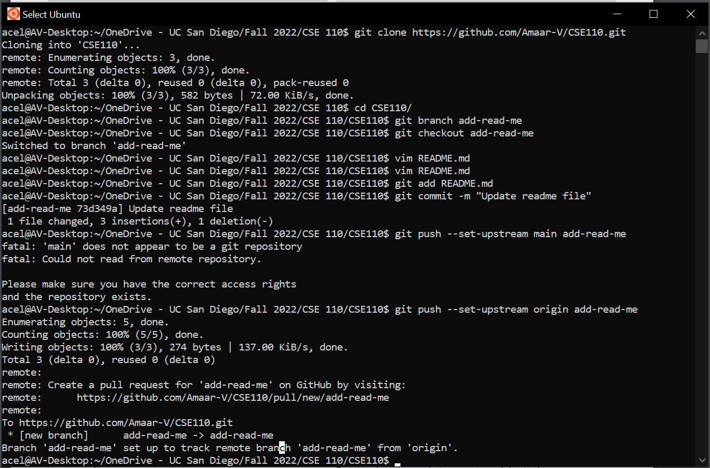
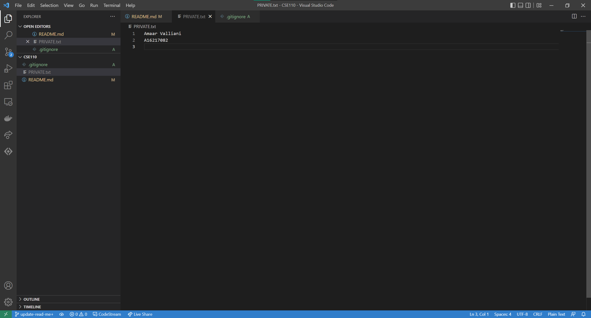
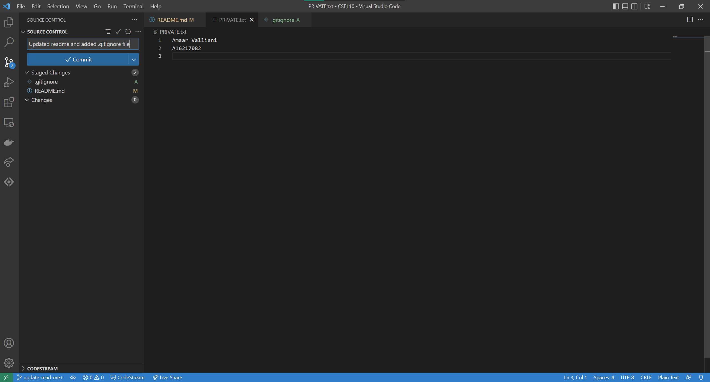

# Amaar's User Page

> [*"You miss 100% of the shots you don't take -Wayne Gretsky"*
> *-Micheal Scott*](https://www.bardown.com/polopoly_fs/1.951196!/fileimage/httpImage/image.png_gen/derivatives/landscape_620/michael-scott.png)

## Table of Contents
- [Amaar's User Page](#amaars-user-page)
  - [Table of Contents](#table-of-contents)
  - [About Me](#about-me)
    - [I am...](#i-am)
    - [I enjoy...](#i-enjoy)
    - [My top 5 favorite arists are...](#my-top-5-favorite-arists-are)
  - [As A Programmer](#as-a-programmer)
  - [Screenshots](#screenshots)
  - [Miscellaneous](#miscellaneous)

## About Me

### I am...
- a third year
- a Mathematics-Computer Science major
- from [Houston, Texas](https://en.wikipedia.org/wiki/Houston)

### I enjoy...
- food and cooking
- video games
- [Formula 1](https://www.youtube.com/watch?v=s5VCm-YxrKQ) 
- swimming
- TV shows and movies
  
### My top 5 favorite arists are...
1. Coldplay
2. Kygo
3. Porter Robinson
4. Imagine Dragons
5. Avicii

## As A Programmer
*I enjoy problem solving through coding*

*I also enjoy theory with an interest in **graph theory**.*

*My favorite programming language is `C++` but I have used `Java` most.*

**I want to learn...**
- [ ] `Javascript`
- [ ] `python`

## Screenshots
1. Command Line 
2. VSC Branch 
3. VSC Commit 

## Miscellaneous
**HELLO:**
```
int main()
{
    cout << "Hello World" << endl;
}
```
Repo [README.md](README.md)

**[Home](#amaars-user-page)**